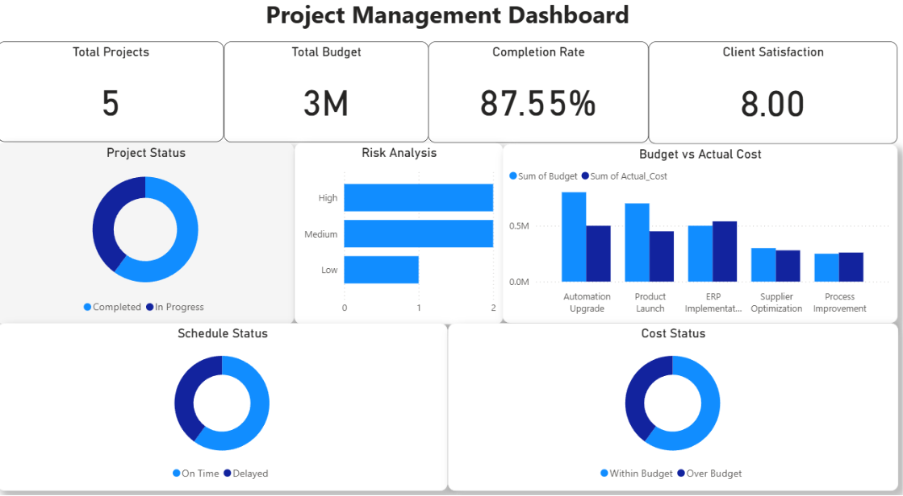

# Project Management Performance Dashboard | Power BI

## 📌 Project Overview

Developed an interactive Project Management Performance Dashboard using Power BI to analyze project performance, budgets, risks, schedules, and client satisfaction metrics.

This dashboard provides a clear overview of key project KPIs and helps project managers monitor progress, identify risks, control costs, and support data-driven decision-making.

---

## 📸 Dashboard Preview

---

## 📊 Dashboard Features

- Total Projects Tracking
- Total Budget Analysis
- Project Completion Rate Monitoring
- Client Satisfaction Score Analysis
- Project Status Tracking (Completed vs In Progress)
- Risk Analysis (High, Medium, Low)
- Budget vs Actual Cost Comparison
- Schedule Status Monitoring
- Cost Status Analysis

---

## 🛠 Tools & Technologies Used

- Microsoft Power BI
- Microsoft Excel
- DAX (Data Analysis Expressions)
- Data Cleaning
- Data Visualization
- Dashboard Design

---

## 📈 Key Insights

- Analyzed overall project completion performance
- Compared allocated budgets with actual project costs
- Identified high, medium, and low-risk projects
- Tracked delayed and on-time project schedules
- Monitored projects running within or over budget

---

## 📂 Repository Files

- Project_Management_Dashboard.pbix - Power BI Dashboard File
- Project_Management_Dashboard.xlsx - Dataset
- Project_Management_Dashboard.pdf - Dashboard Report
- Project_Management_Dashboard.png - Dashboard Screenshot

---

## 🎯 Project Objective

To create a business intelligence dashboard that helps organizations track project performance, optimize resource management, monitor financial efficiency, and improve decision-making using interactive analytics.

---

## 👤 Created By

Gopichand Kollapattu

Engineering Graduate | Aspiring Project Manager | MEM Aspirant

Skills: Power BI • Excel • Data Visualization • Project Management
